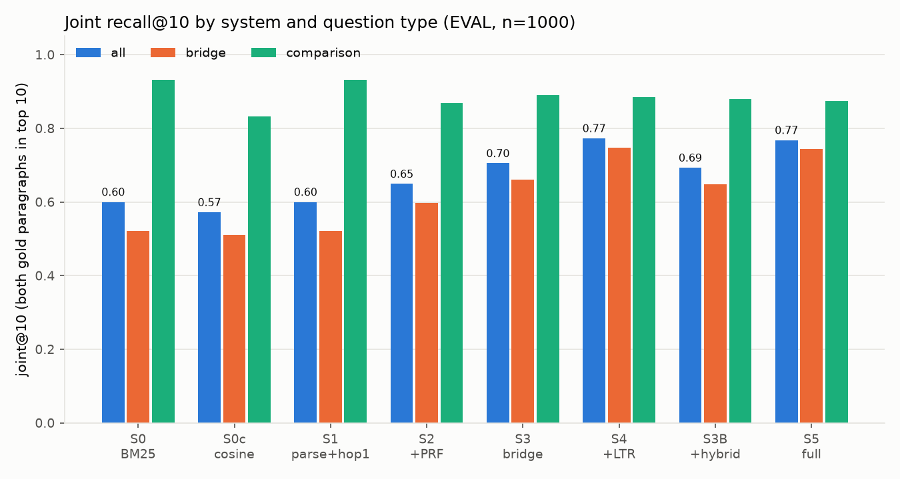
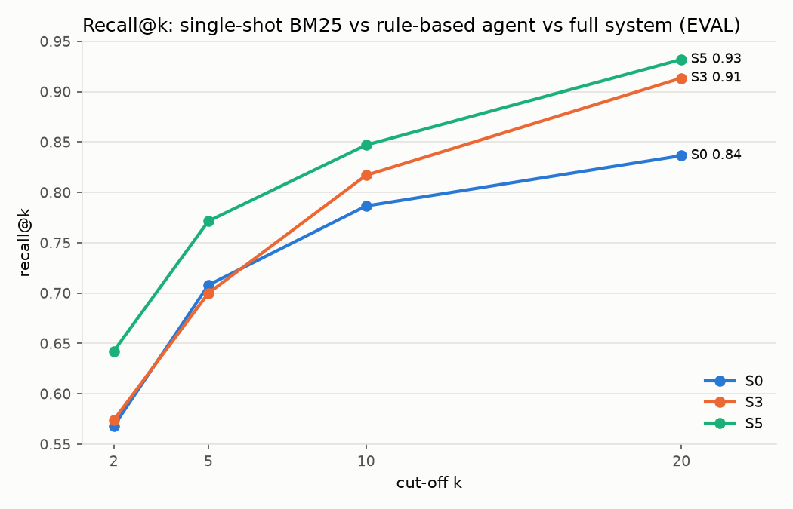
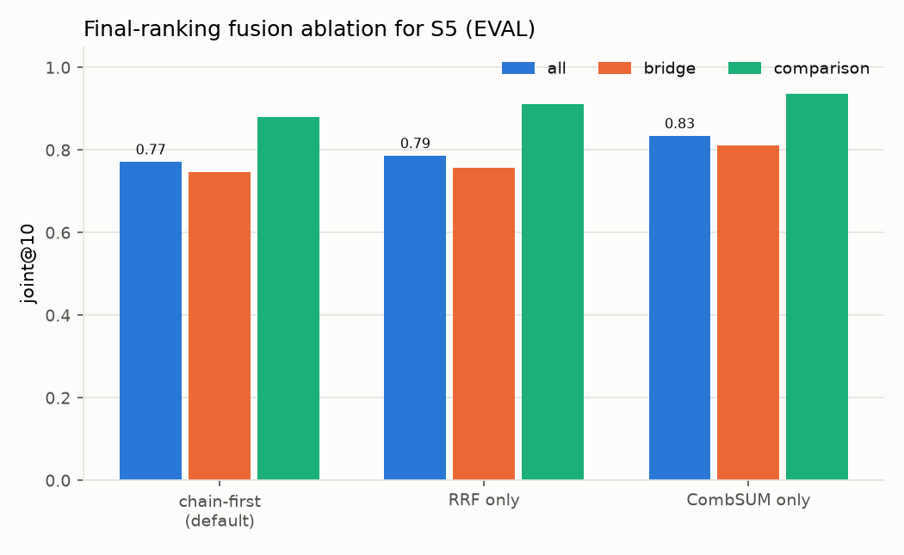

# BridgeHop: Agentic Multi-Hop Retrieval with Bridge Entities and Chain Scoring

**CSD358 Information Retrieval: Hackathon (Midsem) · Track T2: Conversational and agentic search**

| Team member     | Roll number |
| --------------- | ----------- |
| Arnav Jyoti     | 2410110071  |
| Daksh Jain      | 2410110113  |
| Medhavee Binani | 2410110198  |

[Code](https://github.com/DJ-22/CSD358-Hackathon) · [Demo video](https://youtu.be/FB9KRSuUHIY)

---

## 1. Problem and track relevance

**User need.** Many real questions cannot be answered from one document. *"When was the producer of the film Betrayal
born?"* needs two paragraphs: one about the film *Betrayal (1983)*, which names its producer, and one about the producer,
*Sam Spiegel*, which gives his birth date. The first paragraph shares words with the question. The second shares
almost none: it is reachable only through the intermediate **bridge entity** "Sam Spiegel". A single keyword query
finds the first paragraph and misses the second. On our evaluation set, single-shot BM25 does not even rank *Sam
Spiegel* in its top 20.

**Why this is track T2.** T2 asks for *"an agent that issues many queries on the user's behalf"* and that rewrites or
decomposes queries before it retrieves. BridgeHop is exactly that kind of agent:

- it parses the question into a weighted query;
- it builds Boolean and free-text sub-queries for the first hop;
- it decides which terms of the question are already satisfied ("consumed");
- it writes its own second query from the remaining terms plus a bridge entity it found in the first results;
- it fuses all ranked lists into one answer list.

This covers the track's listed IR hooks: Boolean query construction by an agent, query rewriting with
stemming-normalised vocabulary, and a query parser that turns one request into several sub-queries whose scores are
merged. Every step is printed in an inspectable trace.

**Related work.**

- **HotpotQA** [1]: defines the multi-hop QA task and the data we use, with *bridge* and *comparison* questions and
  gold supporting paragraphs.
- **GoldEn Retriever** [2]: the closest idea to ours. It retrieves iteratively by generating the next query with a
  trained neural model.
- **Multi-hop Dense Retrieval (MDR)** [3]: does the same end to end with learned dense encoders.
- **Self-Ask** [4] and **IRCoT** [5]: use a large language model to decompose the question and interleave retrieval with
  reasoning.

All four rely on trained neural query generators or LLMs, and their intermediate decisions are hard to inspect.
BridgeHop builds the second query with classic IR operations (entity-restricted feedback and query consumption) over a
self-built inverted index. It needs no LLM, runs offline on a laptop, and records every decision.

**Data.** We use the HotpotQA *distractor* development set (7,405 questions, CC BY-SA 4.0). Instead of the 10
paragraphs per question that the distractor setting gives, we pool all paragraphs into one corpus of **66,581 unique
Wikipedia paragraphs** and retrieve over all of it. That makes ranking genuinely matter. We draw two disjoint splits
(seed 42):

- **EVAL:** 1,000 questions (809 bridge, 191 comparison), used only for evaluation.
- **TUNE:** 300 questions, the only data any parameter was tuned on.

The learned ranker is trained on 8,000 bridge questions from the HotpotQA *train* shard, with its own separate corpus
and index (71,269 paragraphs), so no training signal touches the evaluation data.

## 2. How we used IR

### Pipeline

```
question
  │
  ▼
[PARSE]  question type (bridge / comparison) · idf-weighted terms · title-dictionary entity linking
  ▼
[HOP 1]  Boolean AND over the 3 highest-idf terms, postings intersected in increasing-df order
  │      (OR fallback if < 20 docs)  ∪  free-text BM25 top 100  →  ranked by zone BM25
  ▼
[STATE]  query consumption: terms matched by the top doc or a question entity are "consumed";
  │      the rest form the residual query
  ▼
[BRIDGE] entity-restricted feedback over the top-5 hop-1 docs → bridge candidates
  │      → hand score (S3)  or  LambdaMART over 12 IR features (S4/S5) → top-3 bridges with p(e)
  ▼
[HOP 2]  per bridge e:  BM25(residual ⊕ e)  or  hybrid: phrase filter "e" (title ∪ body, cap 50)
  │      → α·minmax BM25(residual) + (1−α)·cos(MiniLM) + title bonus
  ▼
[CHAINS] S = λ1·ŝ1(d1) + λ2·p̂(e) + λ3·ŝB(d2)    (each term min-max normalised per question)
  ▼
[FINAL]  chain-first ranking: d1, d2 of best chains, then RRF over all hop lists → top 20
         (comparison questions: one second hop per compared entity, round-robin)
```

### IR principles, where they are and why

| IR principle (lecture topic)                                                                          | Where in the code                                                                  | Why we chose it                                                                                                                      |
| ----------------------------------------------------------------------------------------------------- | ---------------------------------------------------------------------------------- | ------------------------------------------------------------------------------------------------------------------------------------ |
| Tokenisation, case folding, stop words, Porter stemming; positions counted before stop-word removal   | `index/preprocess.py`                                                            | standard normalisation; keeping positions makes phrase queries exact                                                                 |
| Positional**zone index** (title / body), postings sorted by doc id, forward index               | `index/inverted_index.py` (`build`, `phrase_docs`), `index/build_index.py` | titles are the entity names, so the title zone carries the strongest evidence; builds in about 10 s (133,906 terms, 3.06 M postings) |
| **Boolean AND with query optimisation**: intersect postings in increasing df order; OR fallback | `retrieval/boolean.py` (`boolean_and`)                                         | high-precision candidate set from the rarest terms; the df order is shown in the trace                                               |
| **Phrase queries** via positional intersection                                                  | `inverted_index.phrase_docs`                                                     | the hop-2 filter keeps only paragraphs that contain the bridge name exactly (index elimination)                                      |
| **Zone-weighted scoring**, term-at-a-time accumulators, **heap top-K**                    | `retrieval/bm25.py`                                                              | BM25 (outside the syllabus) per zone,`W_TITLE·title + W_BODY·body`; the title weight was tuned on TUNE                           |
| tf-idf**vector space model, lnc.ltc cosine**                                                    | `retrieval/cosine.py`                                                            | the classic baseline S0c                                                                                                             |
| **Query parser** turning one question into sub-queries; idf-weighted query terms                | `agent/parser.py`                                                                | question-type rules (accuracy 0.934), Boolean and free-text sub-queries                                                              |
| **Rocchio pseudo-relevance feedback**                                                           | `retrieval/prf.py`                                                               | the classic expansion baseline S2                                                                                                    |
| Dictionary-based entity linking (longest-match n-grams over title surfaces, df filter)                | `agent/entities.py`                                                              | finds bridge candidates and question entities without any NER model                                                                  |
| **Entity-restricted feedback**: tf-idf of an entity in the top-M docs, weighted by hop-1 score  | `agent/bridge.py` (`bridge_candidates`)                                        | Rocchio-style feedback restricted to entity terms, so it proposes*where* to search next                                            |
| **Query rewriting by consumption** (residual query)                                             | `agent/bridge.py` (`residual_query`)                                           | the second query asks only for what the first hop did not answer                                                                     |
| Rank fusion:**RRF** and **CombSUM**                                                       | `agent/fusion.py`, `agent/chains.py`                                           | merges hop-1 and hop-2 lists; RRF fills the final ranking                                                                            |
| Evaluation: precision@k, recall@k, joint recall, MRR                                                  | `eval/metrics.py`, `eval/run_eval.py`                                          | defined from scratch; every metric reported overall and per question type                                                            |

No search library is used. The index, Boolean and phrase processing, BM25, cosine, feedback, fusion and metrics are
written from scratch. Libraries are used only for Porter stemming and stop words (NLTK), LambdaMART (LightGBM),
sentence embeddings (sentence-transformers) and plotting.

## 3. Beyond IR

**Learning to rank bridge entities (LambdaMART).** The hand score of the bridge candidates is noisy: frequent, generic
entities such as "Paramount Pictures" often beat the true bridge. We therefore re-rank candidates with LightGBM's
LambdaMART [7, 8].

- **Features:** 12, and every one of them is an IR quantity: tf-idf in the source doc, the source doc's hop-1 score and
  rank, mean idf, document frequency in the feedback set, title-zone presence, first position, proximity to consumed
  query terms, length in tokens, the hand score, and two **lookahead** scores. The lookaheads are BM25 and dense cosine
  between the residual query and the candidate entity's own paragraph (`agent/features.py`).
- **Training data:** 8,000 questions from the separate training corpus, using the same pipeline. A candidate is labelled
  positive if it is the gold bridge title.
- **Output:** a softmax over the question's candidates, which becomes the bridge probability p(e).

| Ranker (560 held-out training questions) | hit@1           | hit@3           |
| ---------------------------------------- | --------------- | --------------- |
| hand score                               | 0.362           | 0.746           |
| logistic regression                      | 0.807           | 0.936           |
| **LambdaMART**                     | **0.832** | **0.952** |

Hit@k counts only questions whose gold bridge is among the candidates at all; that holds for 70.0 % of questions (the
candidate-recall ceiling). The most important feature is `lookahead_sparse`, with 49.6 % of the split gain: a good
bridge is one whose own paragraph answers what remains of the question.

**Dense scoring in hop 2 (sparse filter → dense score).** For each bridge, a positional phrase query first keeps only
paragraphs that contain the entity name (on average 8.8 candidates, capped at 50). Those are then scored with
`α·minmax(BM25(residual)) + (1−α)·cos(MiniLM(residual), MiniLM(doc)) + bonus·[title = entity]`, using the pretrained
`all-MiniLM-L6-v2` encoder [9]. α = 0.5 and title bonus = 0.5 were tuned jointly on TUNE.

**How they support the IR side.** The machine-learned parts never retrieve on their own. The ranker only orders
candidates extracted from documents the inverted index returned. The dense model only scores documents that passed a
Boolean phrase filter. IR decides *what* is considered; ML only refines the order.

## 4. Novelty and creativity

The obvious baseline is a single BM25 or tf-idf query. The obvious existing tools (GoldEn, MDR, Self-Ask, IRCoT)
generate the next query with a neural model or an LLM. Our new elements, each tied to a measured result:

| Idea                                         | What is new                                                                                                                                   | Evidence (EVAL, n = 1,000)                                |
| -------------------------------------------- | --------------------------------------------------------------------------------------------------------------------------------------------- | --------------------------------------------------------- |
| **Title-anchored bridge feedback**     | pseudo-relevance feedback restricted to Wikipedia-title entities, so feedback proposes the next*entity* to search for, not just extra terms | S3 joint@10**0.705** vs 0.600 for S0/S1             |
| **Residual query (query consumption)** | the agent removes satisfied terms and searches for the rest plus the bridge                                                                   | part of S3–S5; not ablated on its own (see §6)          |
| **Chain scoring**                      | ranks*paths* (d1 → entity → d2) rather than single documents                                                                              | joint@2**0.537** vs 0.178 (RRF) and 0.215 (CombSUM) |
| **Learned bridge ranker**              | LambdaMART over IR features, including look-ahead retrieval scores                                                                            | S4 joint@10**0.773**; bridge_hit@3 0.459 → 0.569   |
| **Sparse filter → dense score**       | Boolean phrase filter before any embedding comparison                                                                                         | S5 joint@2**0.537** vs 0.494 for S4                 |
| **Training-free, inspectable core**    | S3 uses no learning at all, and every decision is saved as a JSON trace                                                                       | S3 alone +0.105 joint@10 over S0                          |
| **Bridge hit rate**                    | a diagnostic metric that isolates entity selection from retrieval                                                                             | reported for every bridge system                          |

## 5. Evaluation

**Metrics.** Each HotpotQA question has exactly two gold paragraphs.

- **joint@k:** 1 if both gold paragraphs are in the top k. This is our headline metric, since a multi-hop question
  needs both.
- **recall@k** and **P@k:** the standard definitions.
- **MRR:** reciprocal rank of the first gold paragraph.
- **hop2_recall@10:** recall of the gold paragraph that single-shot BM25 ranks lower, i.e. the one that needs a second
  hop.
- **bridge_hit@3:** whether the gold bridge entity is among the 3 chosen bridges.

All parameters were tuned on TUNE only. Every number comes from `results/metrics.csv`, written by
`eval/run_eval.py`.

### 5.1 Main results against baselines

| System                          | P@2             | P@10            | R@10            | R@20            | joint@2         | **joint@10** | MRR   |
| ------------------------------- | --------------- | --------------- | --------------- | --------------- | --------------- | ------------------ | ----- |
| S0 single-shot BM25 (baseline)  | 0.568           | 0.157           | 0.786           | 0.836           | 0.262           | 0.600              | 0.849 |
| S0c lnc.ltc cosine (baseline)   | 0.523           | 0.154           | 0.768           | 0.838           | 0.211           | 0.572              | 0.797 |
| S1 parser + Boolean hop 1       | 0.568           | 0.157           | 0.786           | 0.836           | 0.262           | 0.600              | 0.849 |
| S2 + Rocchio PRF                | 0.428           | 0.162           | 0.808           | 0.862           | 0.128           | 0.649              | 0.706 |
| S3 hand bridges + chains        | 0.574           | 0.163           | 0.817           | 0.914           | 0.340           | 0.705              | 0.802 |
| S4 learned bridges              | 0.648           | 0.170           | 0.848           | 0.930           | 0.494           | **0.773**    | 0.798 |
| S3B hand bridges + hybrid hop 2 | 0.620           | 0.160           | 0.802           | 0.914           | 0.417           | 0.697              | 0.804 |
| **S5 full system**        | **0.671** | **0.170** | **0.850** | **0.934** | **0.537** | 0.772              | 0.795 |

P@10 can be at most 0.2 here, because there are only two relevant paragraphs.

The full system raises joint@10 from 0.600 to 0.772 and doubles joint@2 (0.262 → 0.537). The gain is concentrated
where single-shot search fails: on **bridge** questions joint@10 goes from 0.522 to 0.747, and hop-2 recall from 0.601
to 0.795.





### 5.2 Our own judged queries

We assembled 15 multi-hop questions of our own, outside the HotpotQA question set, with two relevant paragraphs each,
checked against the corpus (`data/own_queries.jsonl`). The questions were drafted with AI help; see the AI-use
declaration. One example: *"Which country was the player from who beat Sandra Reynolds
in the 1960 Wimbledon final?"*, whose relevant paragraphs are *Sandra Reynolds* and *Maria Bueno*.

| 15 own questions       | P@2             | P@10                          |
| ---------------------- | --------------- | ----------------------------- |
| S0 single-shot BM25    | 0.500           | 0.127                         |
| **S5 BridgeHop** | **1.000** | **0.200** (the maximum) |

BM25 finds only one of the two relevant paragraphs in its top 2 for every question. BridgeHop ranks both at positions
1–2 for all 15. Per-question results are in `results/own_queries.md`.

### 5.3 Ablations

| Ablation                                 | Result                                                                                                                                                                                                                         |
| ---------------------------------------- | ------------------------------------------------------------------------------------------------------------------------------------------------------------------------------------------------------------------------------ |
| bridge selection × hop-2 scoring (2×2) | hand + BM25**0.705** · hand + hybrid 0.697 · learned + BM25 **0.773** · learned + hybrid 0.772 (joint@10); the learned ranker is the main gain, and hybrid hop 2 helps at the very top (joint@2 0.494 → 0.537) |
| final ranking for S5                     | chain-first 0.772 / 0.537 · RRF 0.787 / 0.178 · CombSUM**0.835** / 0.215 (joint@10 / joint@2): fusing everything maximises coverage, while chain scoring puts the correct *pair* first                               |
| Porter stemming vs none                  | S0 0.600 vs 0.601; S5 0.772 vs 0.767: no meaningful effect on this English Wikipedia corpus                                                                                                                                    |
| tuning (TUNE only)                       | title weight 2.0 →**1.0** raised S0 from 0.507 to 0.597 on TUNE; α and the title bonus peak at 0.5; chain weights λ are flat (0.757–0.760 over the whole grid)                                                       |



## 6. Limitations and next steps

- **The first hop adds nothing on its own.** S1 = S0. The Boolean set only adds documents ranked below BM25's top 100,
  so the top 20 cannot change. We keep S1 as a control: it shows the gains come from the second hop.
- **Bridge candidate recall is the ceiling.** For 30 % of training questions the gold bridge is never extracted, mostly
  because its full title (e.g. *"Edmund Allenby, 1st Viscount Allenby"*) never appears verbatim in the text.
- **Wrong bridges with short residuals.** In *"What county is Keene High School located in?"* the residual is only
  "county". The lookahead feature then prefers another school's "Carroll County", and the correct paragraph drops from
  rank 1 to rank 3.
- **Comparison questions dip slightly**, from 0.932 to 0.880 joint@10. Single-shot search already solves most of them,
  and the per-entity hops reshuffle the list.
- **The residual query is not ablated on its own**, so its individual contribution is a design argument rather than a
  measured row.
- **Scope.** BridgeHop retrieves the supporting paragraphs; it does not extract an answer string. The system is
  single-turn.

**Roadmap (course project).**

1. Entity-level first-hop sub-queries fused with RRF, so the first hop itself improves.
2. Wider candidate extraction with fuzzy title matching, to lift the 70 % ceiling.
3. An ablation without the residual query.
4. A learned final ranking that combines CombSUM's coverage with chain-first precision.
5. Multi-turn conversational follow-ups ("and where was he born?") that reuse the trace as dialogue context.
6. Evaluation on the HotpotQA *fullwiki* setting with a larger corpus.

## 7. Work division

| Member                                 | Owned components                                                                                                                                                                                                                                                                                                                                                                                                                                                                                                                                                                                                                                                                                                                                                                          |
| -------------------------------------- | ----------------------------------------------------------------------------------------------------------------------------------------------------------------------------------------------------------------------------------------------------------------------------------------------------------------------------------------------------------------------------------------------------------------------------------------------------------------------------------------------------------------------------------------------------------------------------------------------------------------------------------------------------------------------------------------------------------------------------------------------------------------------------------------- |
| **Daksh Jain** (2410110113)      | Agent and evaluation side.• Evaluation metrics and harness (`eval/metrics.py`, `eval/run_eval.py`)• Title-dictionary entity linker (`agent/entities.py`)• Bridge extraction, hand score and residual query (`agent/bridge.py`)• The 12 ranking features, LambdaMART / logistic-regression training and inference (`agent/features.py`, `agent/train_bridge_ltr.py`, `agent/bridge_ranker.py`)• Chain scoring and fusion (`agent/chains.py`, `agent/fusion.py`)• System pipeline S0–S5 (`agent/pipeline.py`, `agent/resources.py`)• Tuning on TUNE, including the title bonus (`eval/tune.py`)• Full evaluation, ablations, plots and summary tables (`eval/plots.py`, `results/`)• End-to-end reproducibility check of the README• Report §3–§5 |
| **Arnav Jyoti** (2410110071)     | Index and query side.• Data preparation, corpora and EVAL/TUNE splits (`data/prepare.py`)• Text analysis and the positional zone index (`index/preprocess.py`, `index/inverted_index.py`, `index/build_index.py`)• BM25, lnc.ltc cosine, Boolean AND/OR, phrase queries and Rocchio feedback (`retrieval/`)• Question parser and hop 1 (`agent/parser.py`)• Hop 2 in BM25 and hybrid mode, and MiniLM embeddings (`agent/hop2.py`, `index/embed.py`)• Inspectable demo and saved traces (`demo.py`, `runs/`)• Own-query runner (`eval/run_own_queries.py`)• README• Report §2                                                                                                                                                                             |
| **Medhavee Binani** (2410110198) | Problem framing and error analysis.• Literature review and track positioning (report §1)• The own-question evaluation set: 15 multi-hop questions with checked relevant paragraphs (`data/own_queries.jsonl`) and the S0 vs S5 P@k comparison (`results/own_queries.md`)• Error analysis of the demo traces (the failure case, the comparison-question dip and the candidate ceiling)• Limitations and roadmap (report §6)• Video structure and recording                                                                                                                                                                                                                                                                                                                      |

In the video, each member presents the components they own.

## AI-use Declaration

- **Tests.** The test suite in `tests/` was written by AI.
- **Code review.** Code review and the end-to-end reproducibility check of the README were done with AI.
- **Demo and own queries.** The demo questions and the own-evaluation questions were produced by asking AI. Their gold
  paragraphs were checked against the corpus.
- **No LLM in the system.** BridgeHop itself calls no LLM or external API at run time. The only pretrained model it
  uses is the `all-MiniLM-L6-v2` sentence encoder for dense scoring.

## References

1. Z. Yang, P. Qi, S. Zhang, Y. Bengio, W. Cohen, R. Salakhutdinov, C. D. Manning. *HotpotQA: A Dataset for Diverse,
   Explainable Multi-hop Question Answering.* EMNLP 2018.
2. P. Qi, X. Lin, L. Mehr, Z. Wang, C. D. Manning. *Answering Complex Open-domain Questions Through Iterative Query
   Generation* (GoldEn Retriever). EMNLP 2019.
3. W. Xiong, X. L. Li, S. Iyer, J. Du, P. Lewis, W. Y. Wang, Y. Mehdad, W. Yih, S. Riedel, D. Kiela, B. Oğuz.
   *Answering Complex Open-Domain Questions with Multi-Hop Dense Retrieval.* ICLR 2021.
4. O. Press, M. Zhang, S. Min, L. Schmidt, N. A. Smith, M. Lewis. *Measuring and Narrowing the Compositionality Gap in
   Language Models* (Self-Ask). Findings of EMNLP 2023.
5. H. Trivedi, N. Balasubramanian, T. Khot, A. Sabharwal. *Interleaving Retrieval with Chain-of-Thought Reasoning for
   Knowledge-Intensive Multi-Step Questions* (IRCoT). ACL 2023.
6. C. D. Manning, P. Raghavan, H. Schütze. *Introduction to Information Retrieval.* Cambridge University Press, 2008.
7. C. J. C. Burges. *From RankNet to LambdaRank to LambdaMART: An Overview.* Microsoft Research Technical Report
   MSR-TR-2010-82, 2010.
8. G. Ke et al. *LightGBM: A Highly Efficient Gradient Boosting Decision Tree.* NeurIPS 2017.
9. N. Reimers, I. Gurevych. *Sentence-BERT: Sentence Embeddings using Siamese BERT-Networks.* EMNLP 2019 (model
   `sentence-transformers/all-MiniLM-L6-v2`).
10. S. Robertson, H. Zaragoza. *The Probabilistic Relevance Framework: BM25 and Beyond.* Foundations and Trends in
    Information Retrieval, 2009.
11. G. V. Cormack, C. L. A. Clarke, S. Büttcher. *Reciprocal Rank Fusion Outperforms Condorcet and Individual Rank
    Learning Methods.* SIGIR 2009.
12. J. J. Rocchio. *Relevance Feedback in Information Retrieval.* In *The SMART Retrieval System*, 1971.
13. M. F. Porter. *An Algorithm for Suffix Stripping.* Program, 14(3), 1980.

## Appendix A: Reproducing the results

```bash
python data/prepare.py                                   # HotpotQA download, corpora, EVAL/TUNE splits
python index/build_index.py --corpus dev                 # also: --corpus train, --corpus dev --no-stem
python index/embed.py --corpus dev                       # also: --corpus train (slow step, about 26 min each)
python agent/train_bridge_ltr.py                         # learned bridge ranker
python eval/tune.py                                      # optional: re-tune on TUNE only
python eval/run_eval.py --systems all                    # every system on EVAL -> results/metrics.csv
python eval/plots.py                                     # plots and summary tables
python eval/run_own_queries.py                           # own judged questions
pytest tests/                                            # 71 tests
```

We re-ran the full sequence end to end. It reproduced `results/metrics.csv` exactly; only the timing columns differ.

## Appendix B: An example trace

`python demo.py --replay 5a73595055429901807dafd6` (S5, *"When was the producer of the film Betrayal born?"*):

- **Hop 1:** Boolean AND in df order: `betray` (df 40) → `produc` (df 6,302) → `film` (df 9,723).
- **Residual query:** `born`.
- **Bridges:** the hand score prefers *paramount pictures* (5.05) over *sam spiegel* (3.25). The learned ranker gives
  *sam spiegel* p = 0.655.
- **Hop 2:** the phrase filter leaves one paragraph, *Sam Spiegel*.
- **Chains:** the top chain *Betrayal (1983 film) → sam spiegel → Sam Spiegel* scores S = 0.700.
- **Final ranking:** both gold paragraphs at ranks 1–2. Single-shot BM25 ranks *Sam Spiegel* below 20.
